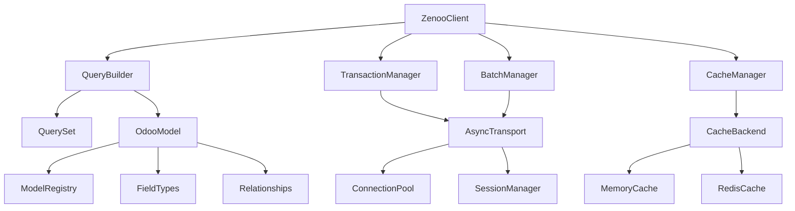
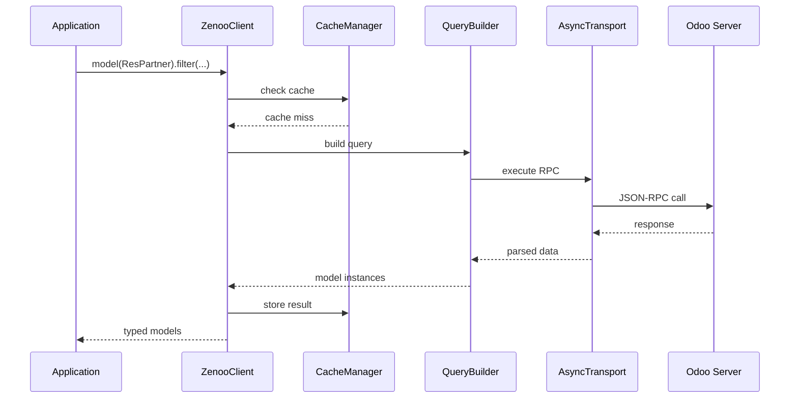

# Zenoo RPC Architecture

Comprehensive architectural overview of Zenoo RPC, covering layered architecture, component interactions, design patterns, and scalability considerations for enterprise deployments.

## Overview

Zenoo RPC follows a **Clean Architecture** approach with clear separation of concerns, dependency inversion, and modular design. The architecture emphasizes:

- **Async-First Design**: Built for modern async/await patterns
- **Type Safety**: Full type safety with Pydantic models
- **Modularity**: Loosely coupled components with clear interfaces
- **Scalability**: Designed for high-performance enterprise applications
- **Testability**: Clean interfaces enable comprehensive testing

## Architectural Layers

### 1. Presentation Layer (Client Interface)

The outermost layer providing the main API interface.

```python
# Main client interface
from zenoo_rpc import ZenooClient

async with ZenooClient("localhost", port=8069) as client:
    await client.login("demo", "admin", "admin")
    partners = await client.model(ResPartner).filter(is_company=True).all()
```

**Components:**

- **ZenooClient**: Main entry point and facade
- **QueryBuilder**: Fluent query interface
- **Model Classes**: Type-safe Pydantic models

**Responsibilities:**

- API surface and developer experience
- Input validation and sanitization
- Authentication and session management
- High-level operation orchestration

### 2. Application Layer (Business Logic)

Core business logic and application services.

```python
# Application services
class PartnerService:
    def __init__(self, client: ZenooClient):
        self.client = client
    
    async def create_company_with_contacts(self, company_data, contacts):
        async with self.client.transaction() as tx:
            company = await self.client.create("res.partner", company_data)
            
            for contact in contacts:
                contact["parent_id"] = company["id"]
                await self.client.create("res.partner", contact)
            
            return company
```

**Components:**

- **Transaction Manager**: ACID transaction handling
- **Batch Manager**: Bulk operation coordination
- **Cache Manager**: Intelligent caching strategies
- **Retry Manager**: Resilience and fault tolerance

**Responsibilities:**

- Business workflow orchestration
- Transaction boundary management
- Cross-cutting concerns (caching, retry, etc.)
- Domain logic coordination

### 3. Domain Layer (Models & Logic)

Domain models and business rules.

```python
# Domain models with business logic
class ResPartner(OdooModel):
    _odoo_name: ClassVar[str] = "res.partner"
    
    name: str
    email: Optional[str] = None
    is_company: bool = False
    
    # Business logic
    def is_valid_email(self) -> bool:
        return self.email and "@" in self.email
    
    def get_display_name(self) -> str:
        return f"{self.name} ({self.email})" if self.email else self.name
```

**Components:**

- **OdooModel**: Base model with validation
- **Field Types**: Specialized field implementations
- **Relationships**: Lazy loading and relationship management
- **Validation Rules**: Business rule enforcement

**Responsibilities:**

- Domain entity representation
- Business rule validation
- Relationship management
- Data integrity enforcement

### 4. Infrastructure Layer (External Concerns)

External system integration and technical concerns.

```python
# Infrastructure components
class AsyncTransport:
    """HTTP transport with connection pooling."""
    
    async def json_rpc_call(self, service: str, method: str, params: dict):
        # HTTP/2 connection pooling
        # Retry logic with exponential backoff
        # Error mapping and handling
        pass

class RedisCache:
    """Enterprise Redis cache backend."""
    
    async def get(self, key: str) -> Optional[Any]:
        # Circuit breaker pattern
        # Fallback to memory cache
        # Serialization handling
        pass
```

**Components:**

- **Transport Layer**: HTTP communication with Odoo
- **Cache Backends**: Memory and Redis implementations
- **Connection Pooling**: Efficient resource management
- **Serialization**: JSON/Pickle data conversion

**Responsibilities:**

- External system communication
- Resource management (connections, memory)
- Data persistence and caching
- Infrastructure concerns (logging, monitoring)

## Component Architecture

### Core Components Interaction



### Data Flow Architecture



## Design Patterns

### 1. Repository Pattern

Abstraction over data access with type-safe interfaces.

```python
# Repository pattern implementation
class ModelRepository:
    def __init__(self, client: ZenooClient, model_class: Type[T]):
        self.client = client
        self.model_class = model_class
    
    async def find_by_id(self, id: int) -> Optional[T]:
        return await self.client.model(self.model_class).filter(id=id).first()
    
    async def find_all(self, filters: Dict[str, Any]) -> List[T]:
        return await self.client.model(self.model_class).filter(**filters).all()
    
    async def create(self, data: Dict[str, Any]) -> T:
        result = await self.client.create(self.model_class._odoo_name, data)
        return self.model_class(**result)
```

### 2. Unit of Work Pattern

Transaction boundary management with automatic rollback.

```python
# Unit of Work pattern
class UnitOfWork:
    def __init__(self, client: ZenooClient):
        self.client = client
        self._transaction = None
    
    async def __aenter__(self):
        self._transaction = await self.client.begin_transaction()
        return self
    
    async def __aexit__(self, exc_type, exc_val, exc_tb):
        if exc_type:
            await self._transaction.rollback()
        else:
            await self._transaction.commit()

# Usage
async with UnitOfWork(client) as uow:
    await uow.partners.create(company_data)
    await uow.contacts.create(contact_data)
    # Auto-commit on success, rollback on exception
```

### 3. Strategy Pattern

Pluggable algorithms for caching, retry, and batch processing.

```python
# Strategy pattern for caching
class CacheStrategy(ABC):
    @abstractmethod
    async def get(self, key: str) -> Optional[Any]:
        pass
    
    @abstractmethod
    async def set(self, key: str, value: Any, ttl: Optional[int] = None) -> bool:
        pass

class TTLCacheStrategy(CacheStrategy):
    """Time-based cache strategy."""
    
class LRUCacheStrategy(CacheStrategy):
    """Least Recently Used cache strategy."""

# Strategy selection
cache_manager = CacheManager()
await cache_manager.setup_strategy("ttl", TTLCacheStrategy())
```

### 4. Decorator Pattern

Cross-cutting concerns like retry, caching, and transactions.

```python
# Decorator pattern for cross-cutting concerns
@async_retry(max_attempts=3, backoff=ExponentialBackoff())
@cached(ttl=300, key_prefix="partners")
@transactional
async def get_company_partners(company_id: int) -> List[ResPartner]:
    return await client.model(ResPartner).filter(
        parent_id=company_id,
        is_company=False
    ).all()
```

### 5. Factory Pattern

Dynamic model and component creation.

```python
# Factory pattern for models
class ModelFactory:
    _registry: Dict[str, Type[OdooModel]] = {}
    
    @classmethod
    def register(cls, odoo_name: str, model_class: Type[OdooModel]):
        cls._registry[odoo_name] = model_class
    
    @classmethod
    def create(cls, odoo_name: str, data: Dict[str, Any]) -> OdooModel:
        model_class = cls._registry.get(odoo_name)
        if not model_class:
            raise ValueError(f"Unknown model: {odoo_name}")
        return model_class(**data)

# Usage
@register_model("res.partner")
class ResPartner(OdooModel):
    _odoo_name: ClassVar[str] = "res.partner"
```

## Scalability Architecture

### Horizontal Scaling

```python
# Connection pooling for horizontal scaling
class ScalableClient:
    def __init__(self, servers: List[str]):
        self.pools = [
            ConnectionPool(server, max_connections=50)
            for server in servers
        ]
        self.load_balancer = RoundRobinBalancer(self.pools)
    
    async def execute(self, operation):
        pool = await self.load_balancer.get_connection()
        return await pool.execute(operation)
```

### Caching Layers

```python
# Multi-tier caching architecture
class TieredCacheManager:
    def __init__(self):
        self.l1_cache = MemoryCache(max_size=1000)      # Fast, small
        self.l2_cache = RedisCache(url="redis://...")   # Shared, larger
        self.l3_cache = DatabaseCache()                 # Persistent
    
    async def get(self, key: str) -> Optional[Any]:
        # L1 -> L2 -> L3 -> Source
        value = await self.l1_cache.get(key)
        if value is not None:
            return value
        
        value = await self.l2_cache.get(key)
        if value is not None:
            await self.l1_cache.set(key, value)
            return value
        
        # Continue with L3 and source...
```

### Async Processing

```python
# Async processing architecture
class AsyncProcessor:
    def __init__(self, max_concurrency: int = 10):
        self.semaphore = asyncio.Semaphore(max_concurrency)
        self.queue = asyncio.Queue()
    
    async def process_batch(self, operations: List[Operation]):
        tasks = [
            self._process_with_semaphore(op)
            for op in operations
        ]
        return await asyncio.gather(*tasks, return_exceptions=True)
    
    async def _process_with_semaphore(self, operation):
        async with self.semaphore:
            return await operation.execute()
```

## Performance Considerations

### Connection Management

```python
# Efficient connection management
class ConnectionManager:
    def __init__(self):
        self.pool = httpx.AsyncClient(
            limits=httpx.Limits(
                max_keepalive_connections=20,
                max_connections=100,
                keepalive_expiry=30.0
            ),
            http2=True,  # HTTP/2 for multiplexing
            timeout=httpx.Timeout(30.0)
        )
    
    async def request(self, method: str, url: str, **kwargs):
        # Automatic connection reuse
        # HTTP/2 multiplexing
        # Keep-alive optimization
        return await self.pool.request(method, url, **kwargs)
```

### Memory Management

```python
# Memory-efficient data processing
class MemoryEfficientProcessor:
    async def process_large_dataset(self, query: QueryBuilder):
        # Stream processing to avoid memory issues
        async for batch in query.batch(chunk_size=1000):
            await self.process_batch(batch)
            # Memory is freed after each batch
    
    async def process_batch(self, records: List[OdooModel]):
        # Process batch with bounded memory usage
        tasks = [self.process_record(record) for record in records]
        await asyncio.gather(*tasks)
```

### Query Optimization

```python
# Query optimization strategies
class OptimizedQueryBuilder:
    def __init__(self, model_class: Type[T], client: ZenooClient):
        self.model_class = model_class
        self.client = client
        self._prefetch_fields = []
        self._select_fields = []
    
    def prefetch_related(self, *fields: str):
        """Prefetch related fields to avoid N+1 queries."""
        self._prefetch_fields.extend(fields)
        return self
    
    def only(self, *fields: str):
        """Select only specific fields to reduce data transfer."""
        self._select_fields.extend(fields)
        return self
    
    async def all(self) -> List[T]:
        # Optimized query with prefetching and field selection
        return await self._execute_optimized_query()
```

## Security Architecture

### Authentication & Authorization

```python
# Secure authentication handling
class SecureAuthManager:
    def __init__(self):
        self._session_store = {}
        self._token_validator = TokenValidator()
    
    async def authenticate(self, database: str, username: str, password: str):
        # Secure password handling
        # Session token generation
        # Rate limiting
        pass
    
    async def validate_session(self, session_token: str) -> bool:
        # Token validation
        # Session expiry checking
        # Security audit logging
        pass
```

### Data Protection

```python
# Data protection and encryption
class DataProtectionManager:
    def __init__(self):
        self.encryptor = Fernet(self._get_encryption_key())
    
    def encrypt_sensitive_data(self, data: str) -> str:
        return self.encryptor.encrypt(data.encode()).decode()
    
    def decrypt_sensitive_data(self, encrypted_data: str) -> str:
        return self.encryptor.decrypt(encrypted_data.encode()).decode()
    
    def _get_encryption_key(self) -> bytes:
        # Secure key management
        pass
```

## Monitoring & Observability

### Metrics Collection

```python
# Comprehensive metrics collection
class MetricsCollector:
    def __init__(self):
        self.counters = {}
        self.histograms = {}
        self.gauges = {}
    
    def increment_counter(self, name: str, tags: Dict[str, str] = None):
        # Request counts, error rates, etc.
        pass
    
    def record_histogram(self, name: str, value: float, tags: Dict[str, str] = None):
        # Response times, query durations, etc.
        pass
    
    def set_gauge(self, name: str, value: float, tags: Dict[str, str] = None):
        # Active connections, cache hit rates, etc.
        pass
```

### Distributed Tracing

```python
# Distributed tracing integration
class TracingManager:
    def __init__(self):
        self.tracer = opentelemetry.trace.get_tracer(__name__)
    
    async def trace_operation(self, operation_name: str, operation_func):
        with self.tracer.start_as_current_span(operation_name) as span:
            try:
                result = await operation_func()
                span.set_status(trace.Status(trace.StatusCode.OK))
                return result
            except Exception as e:
                span.set_status(trace.Status(trace.StatusCode.ERROR, str(e)))
                span.record_exception(e)
                raise
```

## Deployment Architecture

### Container Architecture

```dockerfile
# Multi-stage Docker build
FROM python:3.11-slim as base
WORKDIR /app
COPY requirements.txt .
RUN pip install --no-cache-dir -r requirements.txt

FROM base as development
COPY requirements-dev.txt .
RUN pip install --no-cache-dir -r requirements-dev.txt
COPY . .
CMD ["python", "-m", "pytest"]

FROM base as production
COPY . .
RUN pip install --no-cache-dir .
CMD ["python", "-m", "myapp"]
```

### Kubernetes Deployment

```yaml
# Kubernetes deployment with scaling
apiVersion: apps/v1
kind: Deployment
metadata:
  name: zenoo-rpc-app
spec:
  replicas: 3
  selector:
    matchLabels:
      app: zenoo-rpc-app
  template:
    metadata:
      labels:
        app: zenoo-rpc-app
    spec:
      containers:
      - name: app
        image: zenoo-rpc:latest
        resources:
          requests:
            memory: "256Mi"
            cpu: "250m"
          limits:
            memory: "512Mi"
            cpu: "500m"
        env:
        - name: REDIS_URL
          value: "redis://redis-service:6379"
```

## Best Practices

### 1. Dependency Injection

```python
# Clean dependency injection
class ServiceContainer:
    def __init__(self):
        self._services = {}
    
    def register(self, interface: Type[T], implementation: Type[T]):
        self._services[interface] = implementation
    
    def get(self, interface: Type[T]) -> T:
        implementation = self._services.get(interface)
        if not implementation:
            raise ValueError(f"Service not registered: {interface}")
        return implementation()

# Usage
container = ServiceContainer()
container.register(CacheManager, RedisCacheManager)
cache_manager = container.get(CacheManager)
```

### 2. Configuration Management

```python
# Environment-based configuration
class Config:
    def __init__(self):
        self.odoo_url = os.getenv("ODOO_URL", "http://localhost:8069")
        self.redis_url = os.getenv("REDIS_URL", "redis://localhost:6379")
        self.cache_ttl = int(os.getenv("CACHE_TTL", "300"))
        self.max_connections = int(os.getenv("MAX_CONNECTIONS", "20"))
    
    @classmethod
    def from_env(cls) -> "Config":
        return cls()
```

### 3. Error Handling

```python
# Comprehensive error handling
class ErrorHandler:
    def __init__(self):
        self.logger = logging.getLogger(__name__)
    
    async def handle_with_retry(self, operation, max_retries: int = 3):
        for attempt in range(max_retries):
            try:
                return await operation()
            except RetryableError as e:
                if attempt == max_retries - 1:
                    raise
                await asyncio.sleep(2 ** attempt)  # Exponential backoff
            except NonRetryableError:
                raise  # Don't retry
```

## Next Steps

- Explore [Performance Optimization](performance.md) for detailed performance tuning
- Learn about [Security Considerations](security.md) for production deployments
- Check [Extension Points](extensions.md) for customization and plugins
- Review [Monitoring Setup](../troubleshooting/monitoring.md) for observability
